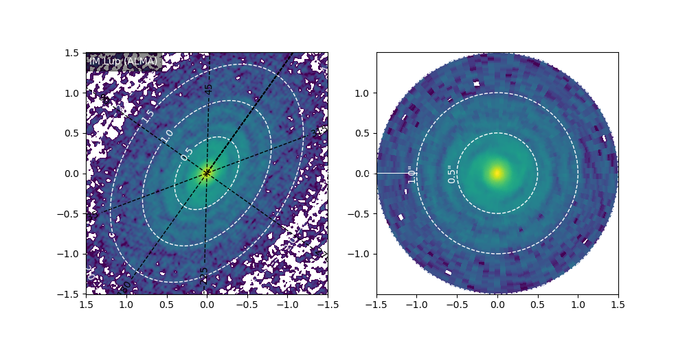
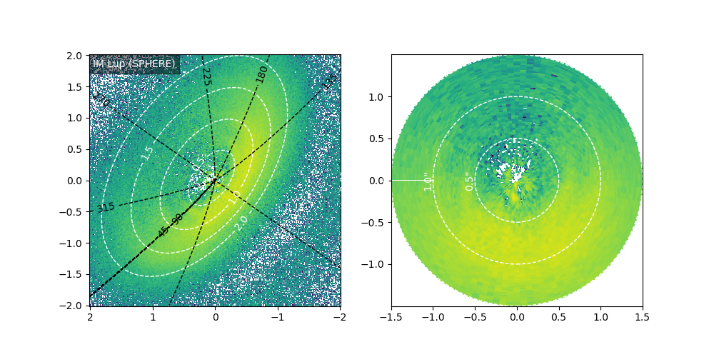

# Deproject disk images

This notebook demonstrates how to use [`gofish`](https://github.com/richteague/gofish) and interpolation to deproject disk images for a given emission surface. The example uses the [SPHERE](https://doi.org/10.3847/1538-4357/aab846) and [ALMA](https://doi.org/10.3847/2041-8213/aaf741) images for the disk around IM Lupi. The latter one is publicly available [here](https://almascience.eso.org/almadata/lp/DSHARP/images/IMLup_continuum.fits).

  
